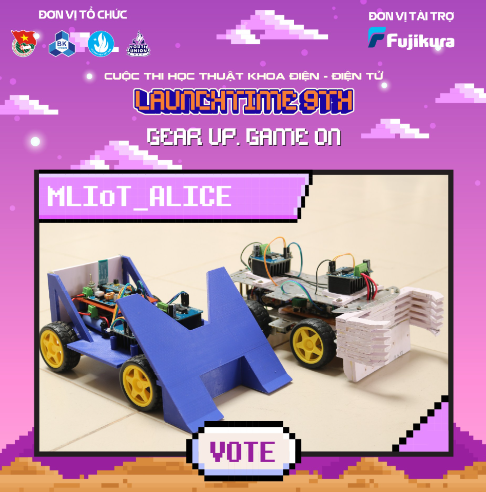
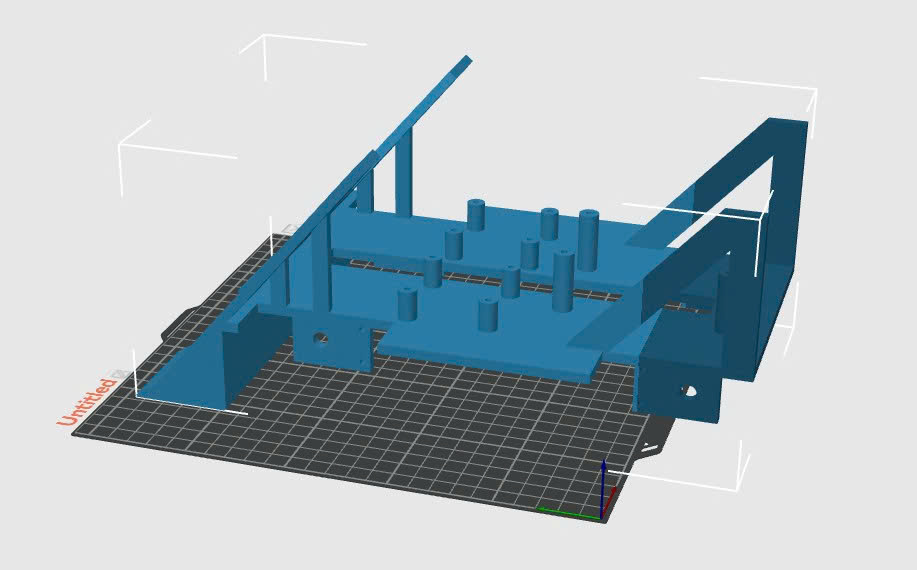
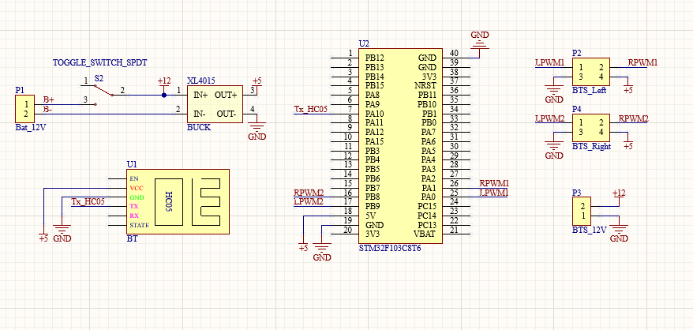
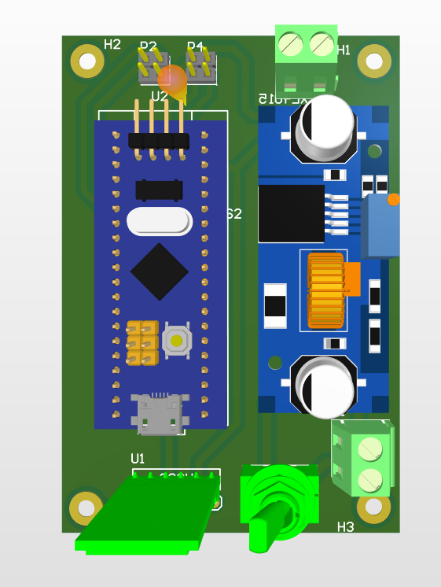

# Robot Soccer - Launchtime 9th

Dự án robot soccer đạt giải nhì cuộc thi Launchtime lần thứ 9.



## Cấu trúc dự án

```
├── 3D_Design/         # Thiết kế 3D (SolidWorks)
│   ├── Khungxe.SLDPRT # File khung xe
│   ├── Asm1.SLDASM    # File lắp ráp
│   └── *.STL          # File in 3D
│
├── PCB_Design/        # Thiết kế mạch (Altium Designer)
│   ├── Sch_ALICE.SchDoc   # Sơ đồ mạch
│   ├── PCB_ALICE.PcbDoc   # Board mạch
│   └── PCB_MLIoT_ALICE.PrjPcb
│
└── SRC/               # Code STM32 (Keil uVision)
    ├── Core/Src/main.c   # Chương trình chính
    ├── Drivers/          # HAL Driver
    └── MDK-ARM/          # Project Keil
```

### Hình ảnh thiết kế







## Phần cứng

- **Vi điều khiển**: STM32F103C8T6
- **Động cơ**: 2x DC Motor với driver L298N
- **Giao tiếp**: UART1 (9600 baud)
- **Nguồn**: 12V DC

## Giao thức điều khiển

Giao tiếp qua UART với các lệnh:

| Lệnh | Chức năng |
|------|-----------|
| F    | Đi tới    |
| B    | Lùi       |
| L    | Quay trái |
| R    | Quay phải |
| G    | Tiến trái |
| I    | Tiến phải |
| H    | Lùi trái  |
| J    | Lùi phải  |
| S    | Dừng      |

### Điều khiển tốc độ

| Lệnh | Tốc độ |
|------|--------|
| 0-9  | 40-94% |
| q    | 100%   |

### Điều khiển phụ kiện

| Lệnh | Chức năng |
|------|-----------|
| W/w  | LED trước |
| U/u  | LED sau   |
| V/v  | Còi       |

## Timeout

Robot sẽ tự dừng sau 1 giây nếu không nhận được lệnh nào.

## Build

Sử dụng Keil uVision để build file `Controller_Car.uvprojx` trong thư mục `SRC/MDK-ARM/`.

## Giải thưởng

- **Giải nhì** - Cuộc thi Launchtime lần thứ 9

## License

MIT License